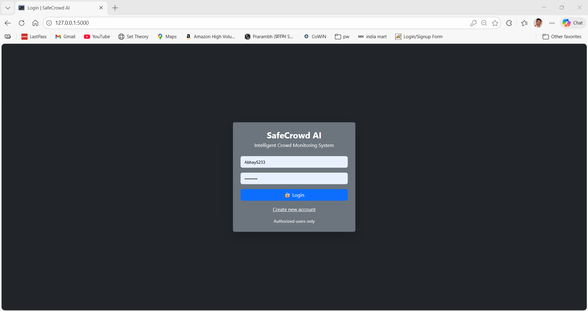

# SafeCrowd AI 🚦

Intelligent Crowd Monitoring & Safety System using **YOLOv8 + ByteTrack**.

---

## 🔥 Features
- Real-time crowd detection & counting
- Unique person tracking using YOLOv8 Track IDs
- Zone-based crowd analytics
- Heatmap visualization
- Email alerts for overcrowding
- Live analytics dashboard
- Graph download & CSV reports

---

## 🛠 Tech Stack
- Python, Flask
- YOLOv8 + ByteTrack
- OpenCV
- SQLite
- Bootstrap, Chart.js

---

## 📸 Screenshots

### 🔐 Login Page


### 📊 Admin Dashboard


### 🎥 Live Crowd Analytics


### 📈 Crowd Graph & Download


---

## ▶️ How to Run

```bash
pip install -r requirements.txt
python main.p
